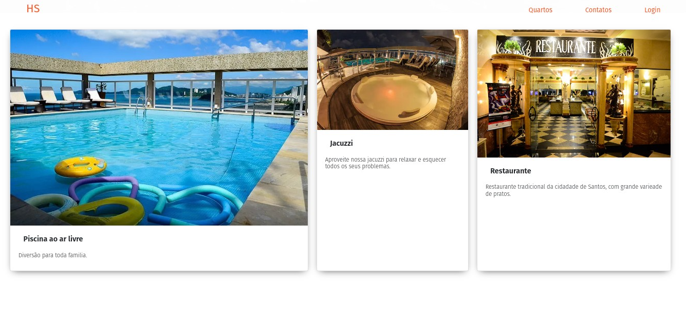

# HotelSantos

<!---Esses são exemplos. Veja https://shields.io para outras pessoas ou para personalizar este conjunto de escudos. Você pode querer incluir dependências, status do projeto e informações de licença aqui--->

 


> Sistema Web Hoteleiro, desenvolvido inicialmente como projeto de finalização da faculdade UNIP curso de Analise e desenvolvimento de sistemas.
### Ajustes e melhorias

O projeto ainda está em desenvolvimento e as próximas atualizações serão voltadas nas seguintes tarefas:

- [x] HomePage 
- [x] Cadastro
- [x] Login
- [x] Alugar um quarto
- [x] Fazer Check out
- [x] Pagina de Contatos
- [x] Servidor na nuvem
- [x] Upar o sistema na Heroku

## 🚀 Instalando

Para instalar o Projeto, siga estas etapas:

Windows:
```
1. Clone o repositorio
2. <npm install>
```

## ☕ startando o projeto

Para startar o sistema HotelSantos, siga estas etapas:

```
npm start
```

## 📫 Contribuindo para o projeto
<!---Se o seu README for longo ou se você tiver algum processo ou etapas específicas que deseja que os contribuidores sigam, considere a criação de um arquivo CONTRIBUTING.md separado--->
Para contribuir com o projeto, siga estas etapas:

1. Bifurque este repositório.
2. Crie um branch: `git checkout -b <nome_branch>`.
3. Faça suas alterações e confirme-as: `git commit -m '<mensagem_commit>'`
4. Envie para o branch original: `git push origin <nome_do_projeto> / <local>`
5. Crie a solicitação de pull.

Como alternativa, consulte a documentação do GitHub em [como criar uma solicitação pull](https://help.github.com/en/github/collaborating-with-issues-and-pull-requests/creating-a-pull-request).

## 🤝 Colaboradores

Agradecemos às seguintes pessoas que contribuíram para este projeto:

<table>
  <tr>
    <td align="center">
      <a href="#">
        <br>
        <sub>
          <b>Carlos Vinicius</b>
        </sub>
      </a>
    </td>
    <td align="center">
      <a href="#">
        <br>
        <sub>
          <b>Murilo Cabral</b>
        </sub>
      </a>
    </td>
    <td align="center">
      <a href="#">
        <br>
        <sub>
          <b>Vinicius Galvão</b>
        </sub>
      </a>
    </td>
  </tr>
</table>